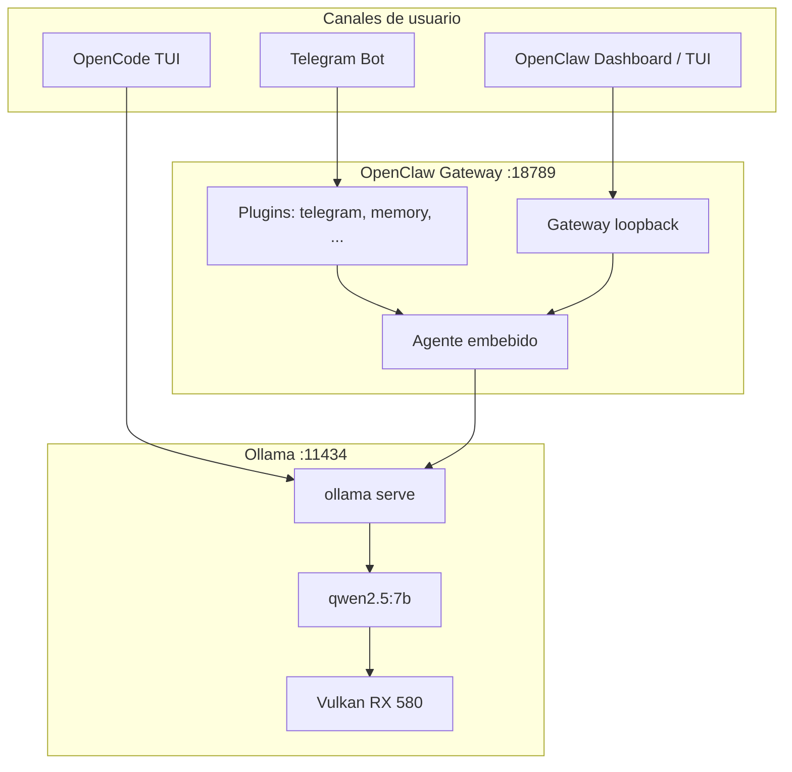

# Funcionalidades del proyecto `configure_openclaw`

Documentación detallada en español del repositorio: qué hace cada pieza, cómo se relacionan y cómo usarlas en tu máquina (Manjaro/Arch, Ollama local, AMD RX 580).

---

## 1. Propósito del proyecto

Este repositorio **no es la aplicación OpenClaw en sí**, sino un **kit de configuración y automatización** para desplegar en local:

| Objetivo | Descripción |
|----------|-------------|
| **IA local sin nube** | Todo el inferencing pasa por **Ollama** en `127.0.0.1:11434`. |
| **Asistente persistente** | **OpenClaw** como gateway (UI, agente, Telegram, cron). |
| **Coding en terminal** | **OpenCode** como agente de código en la terminal, mismo modelo. |
| **GPU AMD** | Scripts y unidad systemd para **Vulkan** en RX 580 8GB. |
| **Reproducibilidad** | Plantillas en `config/` y scripts en `scripts/` versionados en git. |

Los secretos (token de Telegram, token del gateway) **no van en el repo**: viven en `~/.config/openclaw/env` y `~/.openclaw/openclaw.json`.

---

## 2. Arquitectura general



### Flujo de un mensaje por Telegram

1. Telegram envía el mensaje al plugin `channels/telegram` del gateway.
2. OpenClaw resuelve la sesión (`agent:main:telegram:direct:<user_id>`).
3. El agente construye el prompt (system, skills, historial, herramientas).
4. Se llama a Ollama (`POST /api/chat` o API nativa Ollama).
5. Si hay tool calls, el agente puede hacer **varias** llamadas a Ollama.
6. La respuesta se envía de vuelta a Telegram.

Por eso **Telegram no es tan rápido como `ollama run`**: OpenClaw añade capas que un chat directo con Ollama no tiene.

### Flujo con OpenCode

1. Ejecutas `opencode` en un directorio de proyecto.
2. OpenCode lee `~/.config/opencode/opencode.json`.
3. Habla con Ollama vía API compatible OpenAI (`http://127.0.0.1:11434/v1`).
4. Puede editar archivos, ejecutar bash (con permisos), compactar contexto, etc.

OpenClaw y OpenCode **comparten Ollama** pero **no comparten sesiones**. Evita dos inferencias pesadas a la vez.

---

## 3. Perfil de hardware de referencia

| Recurso | Valor en esta máquina |
|---------|------------------------|
| SO | Manjaro / Arch (pacman) |
| CPU | AMD Ryzen 5 4600G (6c / 12t) |
| RAM | 30 GiB |
| GPU | AMD Radeon RX 580 8GB |
| Backend GPU Ollama | Vulkan (`ollama-vulkan`), no ROCm en Polaris |
| Modelo principal | `qwen2.5:7b` (Q4_K_M, ~4.7 GB) |
| Contexto Ollama/OpenClaw | 8192 tokens (equilibrio VRAM/velocidad) |

---

## 4. Componentes software

### 4.1 Ollama

**Función:** Servidor local de modelos LLM.

| Aspecto | Detalle |
|---------|---------|
| Puerto | `11434` |
| Binario esperado | `/usr/bin/ollama` (pacman), **no** `/usr/local/bin/ollama` (0.6.x antiguo) |
| Servicio recomendado | `systemctl --user` → `ollama.service` |
| Modelo por defecto del proyecto | `qwen2.5:7b` |

**Comandos útiles:**

```bash
ollama --version
ollama list
ollama pull qwen2.5:7b
ollama run qwen2.5:7b "hola"
curl -s http://127.0.0.1:11434/api/tags
journalctl --user -u ollama -f
```

**Logs importantes:**

- `library=vulkan` + `RX 580` → GPU activa.
- `library=cpu` → solo CPU (más lento).
- `truncating input prompt` → el prompt supera `num_ctx`; conviene reducir historial o subir contexto con cuidado.

---

### 4.2 OpenClaw

**Función:** Gateway y agente multi-canal (Telegram, dashboard web, sesiones, skills, cron).

| Aspecto | Detalle |
|---------|---------|
| Versión de referencia | `2026.5.12` |
| Node requerido | ≥ 22.12 (nvm recomendado) |
| Gateway | `http://127.0.0.1:18789/` (solo loopback) |
| Config principal | `~/.openclaw/openclaw.json` |
| Modelo configurado | `ollama/qwen2.5:7b` (único, sin fallbacks) |
| Servicio | `openclaw-gateway.service` (usuario) |

**Funcionalidades que usas con este setup:**

| Funcionalidad | Descripción |
|---------------|-------------|
| **Dashboard** | UI web local para chatear y ver sesiones. |
| **Agente embebido** | Razonamiento + herramientas (perfil `minimal` en config optimizada). |
| **Telegram** | Bot con pairing, DM y grupos (mención requerida en grupos). |
| **Sesiones** | Historial por canal/usuario; `/reset` y `/new` en chat. |
| **Skills** | Extensiones (muchas deshabilitadas en config para reducir ruido). |
| **Cron** | Tareas programadas (`openclaw cron list`). |
| **Doctor / status** | Diagnóstico de Node, gateway, canales, modelos. |
| **Compactación** | Resume historial cuando el contexto se llena. |

**Comandos frecuentes:**

```bash
openclaw dashboard
openclaw gateway status
openclaw gateway restart
openclaw doctor
openclaw logs --follow
openclaw models list --provider ollama
openclaw pairing list telegram
openclaw sessions
```

---

### 4.3 OpenCode

**Función:** Agente de código en terminal (TUI), alternativa/complemento a IDEs con IA en la nube.

| Aspecto | Detalle |
|---------|---------|
| Binario | `~/.opencode/bin/opencode` |
| Config | `~/.config/opencode/opencode.json` |
| Variables | `~/.config/opencode/env.sh` |
| Modelo | `ollama/qwen2.5:7b` |

Documentación específica: [OPENCODE.md](./OPENCODE.md).

---

### 4.4 Integración Ollama ↔ herramientas

Ollama incluye lanzadores para varias herramientas:

```bash
ollama launch opencode --model qwen2.5:7b
ollama launch openclaw   # alias: openclaw, clawdbot, moltbot
```

Estos comandos pueden inyectar configuración inline; la de `~/.config/opencode/` y `~/.openclaw/` sigue aplicándose por merge.

---

## 5. Estructura del repositorio

```
configure_openclaw/
├── README.md                 # Guía principal de instalación (inglés)
├── config/                   # Plantillas (sin secretos)
│   ├── openclaw.json.example
│   ├── ollama.service.example
│   ├── opencode.json.example
│   └── env.example
├── scripts/                  # Automatización
│   ├── enable-ollama-gpu.sh
│   ├── enable-telegram.sh
│   ├── fix-telegram-latency.sh
│   ├── install-opencode.sh
│   └── verify-openclaw.sh
└── docs/
    ├── FUNCIONALIDADES.md    # Este archivo
    └── OPENCODE.md           # Guía OpenCode en español
```

### Archivos fuera del repo (en tu sistema)

| Ruta | Función |
|------|---------|
| `~/.openclaw/openclaw.json` | Config activa de OpenClaw |
| `~/.openclaw/workspace/` | AGENTS.md, SOUL.md, skills del agente |
| `~/.openclaw/agents/main/sessions/` | Transcripts JSONL de conversaciones |
| `~/.config/openclaw/env` | `TELEGRAM_BOT_TOKEN` |
| `~/.config/systemd/user/ollama.service` | Daemon Ollama |
| `~/.config/systemd/user/openclaw-gateway.service` | Daemon gateway |
| `~/.config/opencode/opencode.json` | Config OpenCode |
| `/tmp/openclaw/openclaw-*.log` | Logs del gateway |

---

## 6. Plantillas de configuración (`config/`)

### 6.1 `openclaw.json.example`

Referencia de políticas recomendadas para OpenClaw local:

| Clave | Valor | Efecto |
|-------|-------|--------|
| `agents.defaults.model.primary` | `ollama/qwen2.5:7b` | Modelo único. |
| `agents.defaults.model.fallbacks` | `[]` | Sin cambio automático a otro modelo. |
| `agents.defaults.sandbox.mode` | `off` | Sin contenedor Docker por comando. |
| `agents.defaults.thinkingDefault` | `off` | Sin modo “thinking” extendido. |
| `agents.defaults.bootstrapMaxChars` | `3000` | Limita tamaño de archivos bootstrap. |
| `agents.defaults.contextInjection` | `continuation-skip` | En turnos siguientes no reinyecta todo el bootstrap. |
| `agents.defaults.startupContext.enabled` | `false` | Sin bloque extra de memoria al reset. |
| `gateway.bind` | `loopback` | Solo localhost. |
| `gateway.port` | `18789` | Puerto del WebSocket/HTTP. |
| `tools.profile` | `minimal` | Pocas herramientas (menos latencia). |
| `tools.byProvider` | deny web, browser, fs, sessions_* | Restringe herramientas pesadas en Ollama. |
| `models.mode` | `replace` | Solo modelos definidos en config, no catálogo cloud. |
| `models.providers.ollama` | baseUrl + `num_ctx: 8192` | Alinea contexto OpenClaw ↔ Ollama. |
| `channels.telegram` | pairing + token desde env | Bot seguro por defecto. |

**Aplicar fragmentos:**

```bash
openclaw config set agents.defaults.sandbox.mode '"off"' --strict-json
openclaw gateway restart
```

---

### 6.2 `ollama.service.example`

Unidad **systemd de usuario** para Ollama:

| Variable | Propósito |
|----------|-----------|
| `OLLAMA_HOST=127.0.0.1:11434` | Solo local. |
| `OLLAMA_VULKAN=1` | Activa backend Vulkan. |
| `GGML_VK_VISIBLE_DEVICES=0` | GPU 0 = RX 580 discreta (1 = iGPU Renoir). |

Instalación:

```bash
mkdir -p ~/.config/systemd/user
cp config/ollama.service.example ~/.config/systemd/user/ollama.service
systemctl --user daemon-reload
systemctl --user enable --now ollama
```

Si Vulkan no abre `/dev/dri`, añade el usuario a `render` y `video` y descomenta `SupplementaryGroups` en la unidad.

---

### 6.3 `env.example`

Plantilla para secretos de OpenClaw:

```bash
cp config/env.example ~/.config/openclaw/env
chmod 600 ~/.config/openclaw/env
# Editar: TELEGRAM_BOT_TOKEN=...
```

El gateway lee este archivo vía drop-in de systemd o entorno del servicio.

---

### 6.4 `opencode.json.example`

Config OpenCode optimizada para RX 580 + `qwen2.5:7b`:

| Opción | Valor | Motivo |
|--------|-------|--------|
| `model` / `small_model` | `ollama/qwen2.5:7b` | Un solo modelo local. |
| `options.baseURL` | `http://127.0.0.1:11434/v1` | API compatible OpenAI. |
| `num_ctx` | `8192` | Cabe en 8GB VRAM. |
| `timeout` / `chunkTimeout` | 600s / 120s | Inferencia local lenta. |
| `permission.bash` | `ask` | Confirma comandos antes de ejecutar. |
| `webfetch` / `websearch` | `deny` | Sin dependencias web extra. |

---

## 7. Scripts (`scripts/`)

### 7.1 `enable-ollama-gpu.sh`

**Qué hace:**

1. Instala `ollama`, `ollama-vulkan`, `vulkan-radeon`, `lib32-vulkan-radeon`.
2. Comprueba que exista `libggml-vulkan.so`.
3. Añade el usuario a grupos `render` y `video` si hace falta.
4. Copia `ollama.service.example` a `~/.config/systemd/user/`.
5. Reinicia `ollama` y muestra líneas de log con `library=vulkan`.
6. Si OpenClaw está instalado: fija modelo `qwen2.5:7b`, `thinkingDefault: off`, reinicia gateway.

**Cuándo usarlo:** Primera configuración GPU en AMD Polaris (RX 580) o tras reinstalar Ollama.

```bash
./scripts/enable-ollama-gpu.sh
# Tras usermod: cerrar sesión o reiniciar para grupos render/video
```

---

### 7.2 `enable-telegram.sh`

**Qué hace:**

1. Exige `~/.config/openclaw/env` con `TELEGRAM_BOT_TOKEN`.
2. Activa `channels.telegram.enabled` en OpenClaw.
3. Reinicia el gateway.

**Cuándo usarlo:** Después de crear el bot en @BotFather y guardar el token.

```bash
./scripts/enable-telegram.sh
openclaw pairing list telegram
openclaw pairing approve telegram <CÓDIGO>
```

---

### 7.3 `fix-telegram-latency.sh`

**Qué hace:**

1. Ajusta OpenClaw para **menor latencia** en Telegram:
   - `tools.profile: minimal`
   - `contextInjection: never`
   - Límites de bootstrap y skills reducidos
   - `startupContext` desactivado
2. Archiva transcripts JSONL > 100 KB en `sessions/archive-YYYYMMDD-HHMMSS/`.
3. Renombra `BOOTSTRAP.md` → `BOOTSTRAP.md.done` si existe.
4. Resetea sesión `agent:main:main` y borra sesión Telegram si existe.
5. Reinicia el gateway.

**Cuándo usarlo:** Bot muy lento, bucles de herramientas, respuestas tras muchos minutos, o tras muchas pruebas.

```bash
./scripts/fix-telegram-latency.sh
# En Telegram:
/reset
```

**Expectativa realista:** ~20–45 s por mensaje con `qwen2.5:7b` en GPU, no milisegundos como `ollama run`.

---

### 7.4 `verify-openclaw.sh`

**Qué hace:** Chequeo de salud en un solo comando.

| Comprobación | Acción si falla |
|--------------|-----------------|
| Node ≥ 22.12 | `nvm install 22` |
| Ollama en PATH correcto | Mover `/usr/local/bin/ollama` |
| API Ollama `11434` | `systemctl --user start ollama` |
| Servicio ollama activo | `enable --now ollama` |
| `openclaw doctor` | Seguir recomendaciones |
| `gateway status` | `openclaw gateway restart` |
| Modelos Ollama en OpenClaw | `openclaw models set ollama/qwen2.5:7b` |

```bash
./scripts/verify-openclaw.sh
```

---

### 7.5 `install-opencode.sh`

**Qué hace:**

1. Instala o actualiza OpenCode (script oficial `opencode.ai/install`).
2. Comprueba Ollama y descarga `qwen2.5:7b` si falta.
3. Copia `config/opencode.json.example` → `~/.config/opencode/opencode.json`.
4. Crea `~/.config/opencode/env.sh` (PATH, `OLLAMA_HOST`, flags de rendimiento).
5. Añade `source` en `~/.zshrc` si no está.
6. Lista `opencode models ollama`.

```bash
./scripts/install-opencode.sh
source ~/.zshrc
cd tu-proyecto && opencode
```

---

## 8. Funcionalidades por caso de uso

### 8.1 Instalación desde cero

Orden recomendado (detalle en [README.md](../README.md)):

1. Node.js 22+ (nvm).
2. Ollama (pacman, sin binario viejo en `/usr/local`).
3. `./scripts/enable-ollama-gpu.sh` (opcional pero recomendado en RX 580).
4. `ollama pull qwen2.5:7b`.
5. `npm install -g openclaw@latest` + `openclaw onboard`.
6. `loginctl enable-linger` + servicios usuario.
7. `./scripts/verify-openclaw.sh`.
8. Telegram: `env` + `./scripts/enable-telegram.sh`.
9. OpenCode: `./scripts/install-opencode.sh`.

---

### 8.2 Uso diario — OpenClaw

| Tarea | Cómo |
|-------|------|
| Abrir panel de control | `openclaw dashboard` |
| Ver estado | `openclaw gateway status` |
| Reiniciar tras cambio config | `openclaw gateway restart` |
| Ver logs en vivo | `openclaw logs --follow` |
| Listar sesiones | `openclaw sessions` |
| Cambiar modelo (solo 7b en este setup) | `openclaw models set ollama/qwen2.5:7b` |

---

### 8.3 Uso diario — Telegram

| Tarea | Cómo |
|-------|------|
| Primer contacto | Mensaje al bot → `openclaw pairing approve telegram <code>` |
| Nueva conversación limpia | Enviar `/reset` o `/new` |
| Bot lento | `./scripts/fix-telegram-latency.sh` + `/reset` |
| Restringir quién escribe | `channels.telegram.dmPolicy: allowlist` + `commands.ownerAllowFrom` |

---

### 8.4 Uso diario — OpenCode

| Tarea | Cómo |
|-------|------|
| Proyecto nuevo | `cd proyecto && opencode` |
| Un comando rápido | `opencode run "explica main.rs"` |
| Menos arranque lento | Terminal A: `opencode serve`; B: `opencode run --attach http://127.0.0.1:4096 "..."` |
| Lanzar con Ollama | `ollama launch opencode --model qwen2.5:7b` |

Ver [OPENCODE.md](./OPENCODE.md).

---

### 8.5 Mantenimiento y 24/7

```bash
# Servicios siguen tras cerrar sesión gráfica
sudo loginctl enable-linger "$USER"

systemctl --user enable --now ollama.service
systemctl --user enable --now openclaw-gateway.service

systemctl --user status ollama openclaw-gateway
```

---

## 9. Seguridad

| Medida | Implementación en el proyecto |
|--------|-------------------------------|
| Gateway no expuesto a LAN | `bind: loopback` |
| Token Telegram fuera de git | `~/.config/openclaw/env`, chmod 600 |
| DM Telegram | `dmPolicy: pairing` por defecto |
| Grupos Telegram | `requireMention: true` |
| Sin navegador/web en agente local | `deny: group:web, browser` |
| Ejecución bash en OpenCode | `ask` (confirmación) |
| Sandbox Docker | Desactivado (`sandbox.mode: off`) |

**No subas a git:** `~/.openclaw/openclaw.json` (contiene token del gateway), `env`, ni transcripts de sesión.

---

## 10. Solución de problemas (resumen)

| Síntoma | Causa habitual | Acción |
|---------|----------------|--------|
| `could not connect to ollama` | Servicio parado | `systemctl --user start ollama` |
| Ollama 0.6.x / raro | Binario en `/usr/local` | `sudo mv .../ollama.bak` |
| Gateway no arranca | Node viejo | `nvm use 22` |
| Telegram “typing” eterno | CPU o sesión atascada | GPU script + `fix-telegram-latency.sh` + `/reset` |
| Telegram lento pero `ollama run` rápido | Agente + tools + compaction | Normal; optimizar config o usar OpenCode para código |
| `truncating input prompt` en logs | Contexto > `num_ctx` | `/reset`, reducir bootstrap, mantener 8192 en 8GB |
| OpenCode no en PATH | Shell sin recargar | `source ~/.zshrc` |
| Servicios paran al logout | Sin linger | `loginctl enable-linger` |

---

## 11. Documentación relacionada

| Documento | Contenido |
|-----------|-----------|
| [README.md](../README.md) | Instalación paso a paso (inglés) |
| [OPENCODE.md](./OPENCODE.md) | OpenCode: uso, tips, rendimiento |
| [OpenClaw docs](https://docs.openclaw.ai) | Documentación oficial |
| [Ollama + OpenCode](https://docs.ollama.com/integrations/opencode) | Integración Ollama |
| [OpenCode docs](https://opencode.ai/docs) | CLI, config, providers |

---

## 12. Resumen ejecutivo

| Pregunta | Respuesta |
|----------|-----------|
| ¿Qué hace este repo? | Configura y automatiza OpenClaw + Ollama + OpenCode en local. |
| ¿Qué modelo usa? | Solo `qwen2.5:7b` vía Ollama. |
| ¿Dónde chateo por móvil? | Bot de Telegram (tras pairing). |
| ¿Dónde programo con IA? | OpenCode en terminal o dashboard OpenClaw. |
| ¿Cómo acelero GPU? | `./scripts/enable-ollama-gpu.sh` |
| ¿Cómo arreglo Telegram lento? | `./scripts/fix-telegram-latency.sh` + `/reset` |
| ¿Cómo verifico todo? | `./scripts/verify-openclaw.sh` |

Este documento se actualiza con el repositorio; la config **activa** en tu máquina puede tener ajustes adicionales en `~/.openclaw/openclaw.json` respecto a los ejemplos de `config/`.
